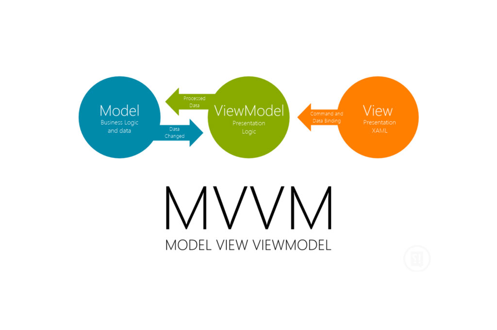

# ImageSearchForKakao - 카카오 검색 api를 이용하여 이미지, 비디오 검색 후 시간을 기준으로 정렬하여 리스트를 보여주는 앱

### 실행전 봐주세요.
- 실기기에서만 검색이 가능합니다.
- api key는 Localproperties에 저장하여 외부로 노출시키지 않아야 하지만 빌드상 오류가 발생할 수 있어 하드코딩으로 넣어두었습니다.

## 🏢 아키텍처
### Clean Architecture (presenter - domain - data 구조)

### MVVM Design Pattern (Model - View - VeiwModel 구성)

## 🛠 기술 스택

### Presenter
- ListAdapter with DiffUtil
- Fragment ktx
- ViewModel ktx

### Data
- Kotlin Serialization - json parsing
- Retrofit - nertwork
- SharedPreferecne - DataBase

### ETC
- Coroutine - asynchronous
- KtLint - code convention
- Git Flow
- Multi Module
- Hilt

## 🚀 Multi Module 구성
### core
1. base
 - 데이터바인딩을 위한 BaseDataBindingFragment, BindingAdapter 구성
 - Dispatcher를 주입받기 위한 DispatcherModule 구성
2. network
  - retrofit 객체 제공
3. data
  - repository interface 및 dto를 정의
  - retrofit serice interface 구성
4. data-implement
  - repository implement 구성
  - 이미지 저장을 위한 ImageSharedPreferenceProvider를 구성
5. domain
  - dto를 비즈니스로직에 적합한 model로 모델링하는 작업 담당
  - 비즈니스로직을 처리하기 위한 유즈케이스 구성
### feature
1. search
 - 검색화면으로 SearchView를 이용하여 키워드를 받고 검색을 수행
 - 이미지들을 2개의 span으로 보여주며 보관함으로 이미지를 롱클릭시 이동하는 기능을 제공
2. storage
 - 저장된 이미지들을 보여주는 리스트 화면
